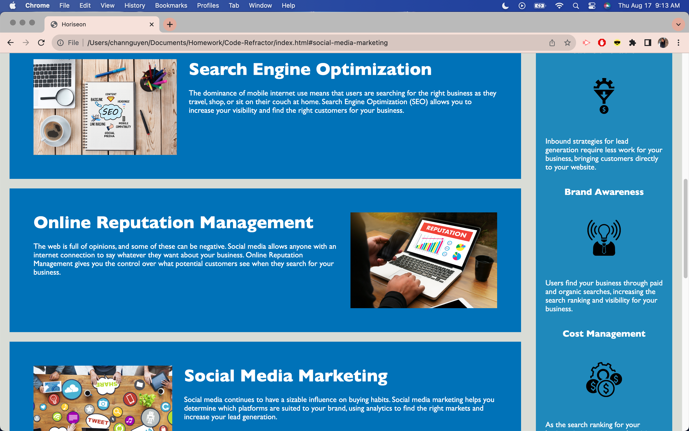
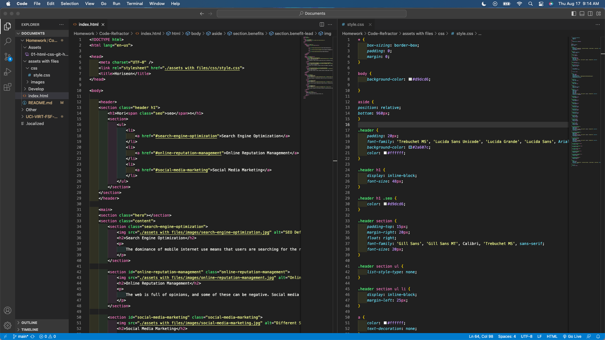

# Code-Refractor

## Description
The goal of refractoring this web page was to increase accessibility to the HTML and CSS components used to create and format the web page. HTML semantic elements are used to easily identify the structure of the web page to help facilitate future edits as needed. THe content of the web page itself provides information on Search Engine Optimization, Online Reputation Management, Social Media Marketing, Lead Generation, Brand Awareness, and Cost Management. 
The deployed application can be found here: https://codeandlift706.github.io/Code-Refractor/

## Installation
GitHub to retrieve the repository content. 
VS Code to manipulate the HTML and CSS elements for the web page.

## Visuals
View a screenshot of the web page here:

View a screenshot of the coding here:

## Credits
The edits that were made to the web page are credited to the curriculum taught in the UCI coding boot camp. In addition, the source for HTML semantic element tags used is: https://www.w3schools.com/html/html5_semantic_elements.asp. To complete the README with screenshots, the source for the code is: https://stackoverflow.com/questions/10189356/how-to-add-screenshot-to-readmes-in-github-repository
The web page and its images are credited to the content in the starter-code repository, found here: https://github.com/coding-boot-camp/urban-octo-telegram
